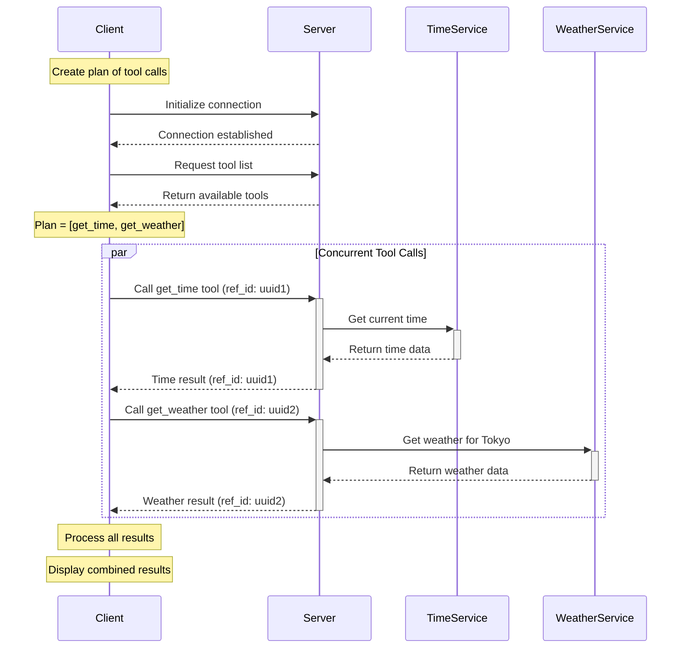

# MCP Agent Parallel Example

This example demonstrates how to execute multiple tool calls concurrently using the Model Context Protocol (MCP). It shows how to build a plan of tool calls, assign unique IDs to each call, and gather all results in parallel.

## What This Example Does

When you run this example:
1. The client connects to an MCP server
2. The client requests the list of available tools
3. The client creates a plan of multiple tool calls (get_time and get_weather)
4. The client executes all tool calls concurrently
5. The client gathers and processes the results
6. The combined results are displayed

## Key Concepts

- **Parallel Execution**: Running multiple tool calls concurrently instead of sequentially
- **Reference Tracking**: Assigning unique IDs to each call to match responses to requests
- **Asynchronous Programming**: Using `asyncio.gather()` to manage concurrent operations
- **Plan-based Execution**: Creating and executing a predefined plan of tool calls

## Learning Objectives

- Understand how to execute multiple MCP tool calls concurrently
- Learn how to track and match responses to their corresponding requests
- See how to improve performance by parallelizing independent operations
- Explore patterns for building efficient agent systems

## Implementation Details

### Plan Structure

A plan is a list of tool call specifications, each containing a tool name and arguments:

```python
plan = [
    {"name": "get_time", "arguments": {}},
    {"name": "get_weather", "arguments": {"city": "Tokyo"}}
]
```

### Execution Flow

The execution flow is visualized in the following diagram:



For more detailed diagrams showing the component structure and reference tracking system, see [mermaid-diagram.md](mermaid-diagram.md).

### Code Implementation

The implementation uses the following approach:

1. **execute_tool_call function**: Executes a single tool call and returns the result
2. **do_plan function**: Creates coroutines for each tool call and executes them concurrently using `asyncio.gather()`
3. **Result processing**: Processes the results from all tool calls and formats them for display

## SDK vs WebSocket Implementation

This example includes two client implementations:

1. **client.py**: Uses the high-level MCP SDK
2. **client_websocket.py**: Uses raw WebSocket communication with JSON-RPC messages

Both implementations demonstrate the same parallel execution pattern but with different communication methods.
## Running the Example

### Prerequisites: OpenAI API Key

Before running this example, set up your OpenAI API key in the `.env` file:

```
OPENAI_API_KEY=your-api-key
OPENAI_BASE_URL=https://api.openai.com/v1
OPENAI_MODEL=gpt-4o
```

> **Note**: If you use the `run_exercises.py` script to run this example, the `.env` file will be created for you automatically.

### Docker Support

This example includes Docker support with helpful scripts:

#### Linux/macOS
- `docker-build.sh`: Builds the Docker image
- `docker-run.sh`: Runs the container with WebSocket implementation
- `docker-clean.sh`: Cleans up containers and images
- `docker-stop.sh`: Stops running containers
- `sdk-run.sh`: Runs the container with SDK implementation

#### Windows
- `docker-build.ps1`: Builds the Docker image
- `docker-run.ps1`: Runs the container with WebSocket implementation
- `docker-clean.ps1`: Cleans up containers and images
- `docker-stop.ps1`: Stops running containers
- `sdk-run.ps1`: Runs the container with SDK implementation

### Running Locally

```bash
# Run the server
./run_server.sh

# In another terminal, run the client
./run_client.sh
```

### Internal Scripts (For Docker Use Only)

The `run.sh` script is used internally by the Docker container and is not intended to be run directly:

```bash
# This is used internally by Docker - DO NOT RUN DIRECTLY
./run.sh
```

It handles:
1. Starting the server in the background
2. Waiting for initialization
3. Running the appropriate client
4. Cleaning up processes when done

> **Important**: Students should always use the Docker scripts (`docker-build.sh`/`docker-run.sh` or `docker-build.ps1`/`docker-run.ps1`) to run the examples, not the internal scripts.
