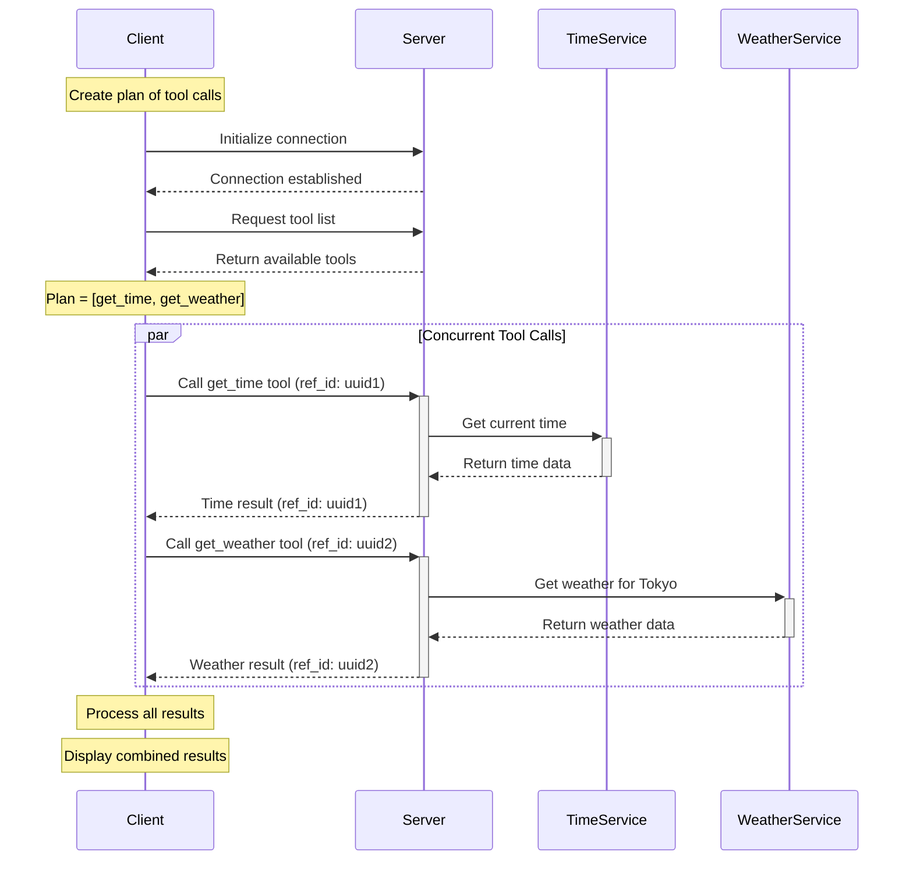

# MCP Agent Parallel Example

This example demonstrates how to execute multiple tool calls concurrently using the Model Context Protocol (MCP). It shows how to build a plan of tool calls, assign unique IDs to each call, and gather all results in parallel.

## Overview

In this example, we create a client that:

1. Connects to an MCP server
2. Requests the list of available tools
3. Creates a plan of multiple tool calls (get_time and get_weather)
4. Executes all tool calls concurrently
5. Gathers and processes the results

## Key Concepts

### Parallel Execution

The core concept demonstrated is parallel execution of tool calls. Instead of calling tools sequentially (one after another), we use `asyncio.gather()` to run multiple tool calls concurrently, which can significantly improve performance when dealing with multiple independent operations.

### Reference Tracking

Each tool call is assigned a unique reference ID (UUID) to track its response. This allows us to match responses to their corresponding requests, even when they arrive out of order.

## Implementation Details

### Plan Structure

A plan is a list of tool call specifications, each containing a tool name and arguments:

```python
plan = [
    {"name": "get_time", "arguments": {}},
    {"name": "get_weather", "arguments": {"city": "Tokyo"}}
]
```

### Execution Flow

The execution flow is visualized in the following diagram:



For more detailed diagrams showing the component structure and reference tracking system, see [mermaid-diagram.md](mermaid-diagram.md).

### Code Structure

The implementation uses the following approach:

1. **execute_tool_call function**: Executes a single tool call and returns the result
2. **do_plan function**: Creates coroutines for each tool call and executes them concurrently using `asyncio.gather()`
3. **Result processing**: Processes the results from all tool calls and formats them for display

## Running the Example

### Prerequisites

- Python 3.8 or higher
- Required packages: `mcp`, `websockets`, `python-dotenv`

### Setup

1. Create a `.env` file with your OpenAI API credentials:
   ```
   OPENAI_API_KEY=your-api-key
   OPENAI_BASE_URL=https://api.openai.com/v1
   OPENAI_MODEL=gpt-4o
   ```

### Running with Docker

```bash
# Build the Docker image
./docker-build.sh

# Run the example
./docker-run.sh
```

### Running Locally

```bash
# Run the server
./run_server.sh

# In another terminal, run the client
./run_client.sh
```

## SDK vs WebSocket Implementation

This example includes two client implementations:

1. **client.py**: Uses the high-level MCP SDK
2. **client_websocket.py**: Uses raw WebSocket communication with JSON-RPC messages

Both implementations demonstrate the same parallel execution pattern but with different communication methods.
