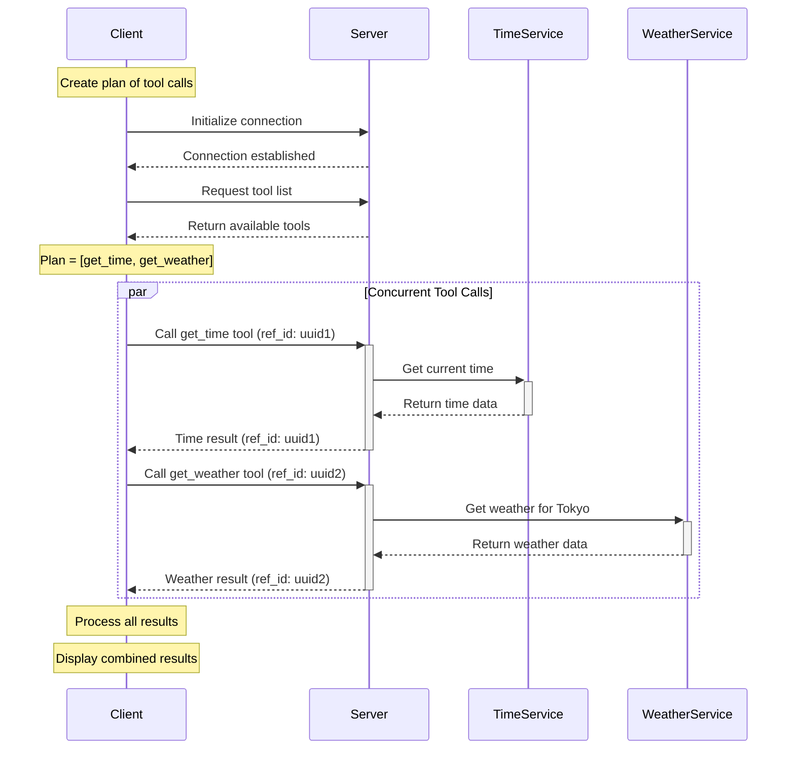

# Parallel Tool Execution Flow Diagram

```mermaid
sequenceDiagram
    participant Client
    participant Server
    participant TimeService
    participant WeatherService
    
    Note over Client: Create plan of tool calls
    
    Client->>Server: Initialize connection
    Server-->>Client: Connection established
    
    Client->>Server: Request tool list
    Server-->>Client: Return available tools
    
    Note over Client: Plan = [get_time, get_weather]
    
    par Concurrent Tool Calls
        Client->>+Server: Call get_time tool (ref_id: uuid1)
        Server->>+TimeService: Get current time
        TimeService-->>-Server: Return time data
        Server-->>-Client: Time result (ref_id: uuid1)
        
        Client->>+Server: Call get_weather tool (ref_id: uuid2)
        Server->>+WeatherService: Get weather for Tokyo
        WeatherService-->>-Server: Return weather data
        Server-->>-Client: Weather result (ref_id: uuid2)
    end
    
    Note over Client: Process all results
    
    Note over Client: Display combined results
```
