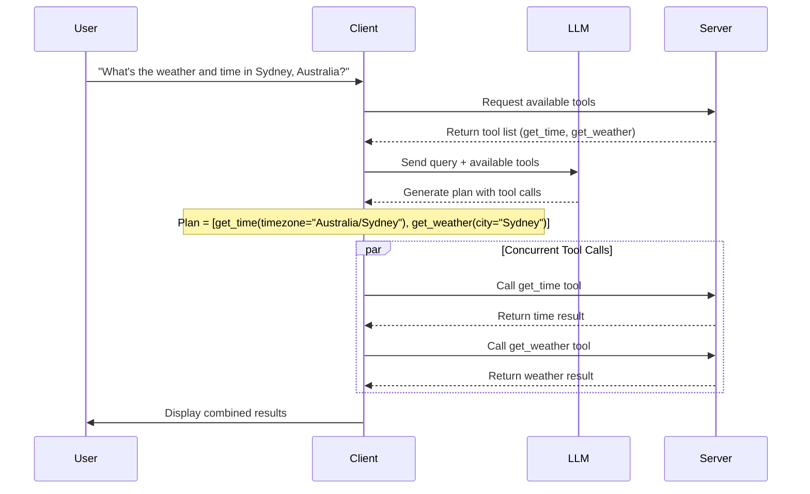

# MCP Agent Planning Example

This example demonstrates how to use an LLM to generate a plan of tool calls based on a user query. It shows how to convert MCP tools to OpenAI function format, send a query to the LLM, extract the generated plan, and execute the tool calls.

## Overview

In this example, we create a client that:

1. Connects to an MCP server
2. Requests the list of available tools
3. Sends a user query to an LLM along with the available tools
4. Extracts the LLM's plan of tool calls
5. Executes the plan and displays the results

## Key Concepts

### LLM-Generated Planning

The core concept demonstrated is using an LLM to generate a plan of tool calls based on a user query. Instead of hardcoding which tools to call, we let the LLM decide which tools are appropriate for the given query and what arguments to use.

This approach has several advantages:
- **Natural language interface**: Users can express their needs in natural language
- **Dynamic tool selection**: The LLM chooses the most appropriate tools for each query
- **Flexible argument handling**: The LLM extracts relevant parameters from the query

### Plan Execution

Once the LLM generates a plan, we execute the tool calls concurrently using `asyncio.gather()`, which can significantly improve performance when dealing with multiple independent operations.

## Implementation Details

### LLM Planning Process

The planning process involves these steps:

1. **Tool Advertisement**: Convert MCP tools to OpenAI function format
2. **Query Processing**: Send the user query to the LLM with the available tools
3. **Plan Extraction**: Extract the tool calls from the LLM's response
4. **Plan Execution**: Execute the tool calls concurrently



### Alternative Planning Approaches

There are several ways to approach tool planning in LLM-based systems:

1. **LLM-Generated Planning (this example)**: The LLM generates a structured plan of tool calls based on the user query.

2. **Rule-Based Planning**: Use predefined rules to determine which tools to call based on keywords or patterns in the user query.
   ```python
   if "weather" in query and "time" in query:
       # Call both weather and time tools
   elif "weather" in query:
       # Call only weather tool
   elif "time" in query:
       # Call only time tool
   ```

3. **Hybrid Planning**: Combine LLM and rule-based approaches, where simple cases are handled by rules and complex cases are delegated to the LLM.
   ```python
   if simple_case(query):
       # Use rule-based planning
   else:
       # Use LLM-generated planning
   ```

4. **Multi-Step Planning**: For complex tasks, use the LLM to generate a high-level plan, then refine each step with additional LLM calls.
   ```python
   high_level_plan = generate_high_level_plan(query)
   for step in high_level_plan:
       detailed_step = refine_step(step)
       execute_step(detailed_step)
   ```

5. **User-Guided Planning**: Allow users to review and modify the LLM-generated plan before execution.
   ```python
   plan = generate_plan(query)
   modified_plan = present_to_user_for_review(plan)
   execute_plan(modified_plan)
   ```

6. **Learning-Based Planning**: Use feedback from previous interactions to improve planning over time.
   ```python
   plan = generate_plan(query, previous_successful_plans)
   results = execute_plan(plan)
   store_plan_and_results(plan, results)
   ```

Each approach has its own advantages and trade-offs in terms of flexibility, control, and user experience.

## Running the Example

### Prerequisites

- Python 3.8 or higher
- Required packages: `mcp`, `openai`, `python-dotenv`, `pytz`, `websockets`

### Setup

1. Create a `.env` file with your OpenAI API credentials:
   ```
   OPENAI_API_KEY=your-api-key
   OPENAI_BASE_URL=https://api.openai.com/v1
   OPENAI_MODEL=gpt-4o
   ```

### Running with Docker

```bash
# Build the Docker image
./docker-build.sh

# Run the example
./docker-run.sh
```

### Running Locally

```bash
# Run the server
./run_server.sh

# In another terminal, run the client
./run_client.sh
```

## SDK vs WebSocket Implementation

This example includes two client implementations:

1. **client_websocket.py**: Uses raw WebSocket communication with JSON-RPC messages with LLM planning (recommended)
2. **client.py**: Uses the high-level MCP SDK with LLM planning

The WebSocket implementation is the default and recommended approach as it provides more direct control over the communication protocol and better illustrates the underlying mechanics of the MCP protocol.
